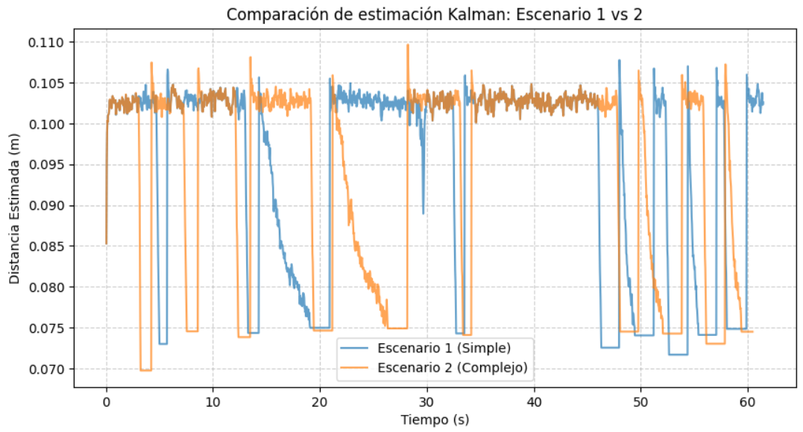
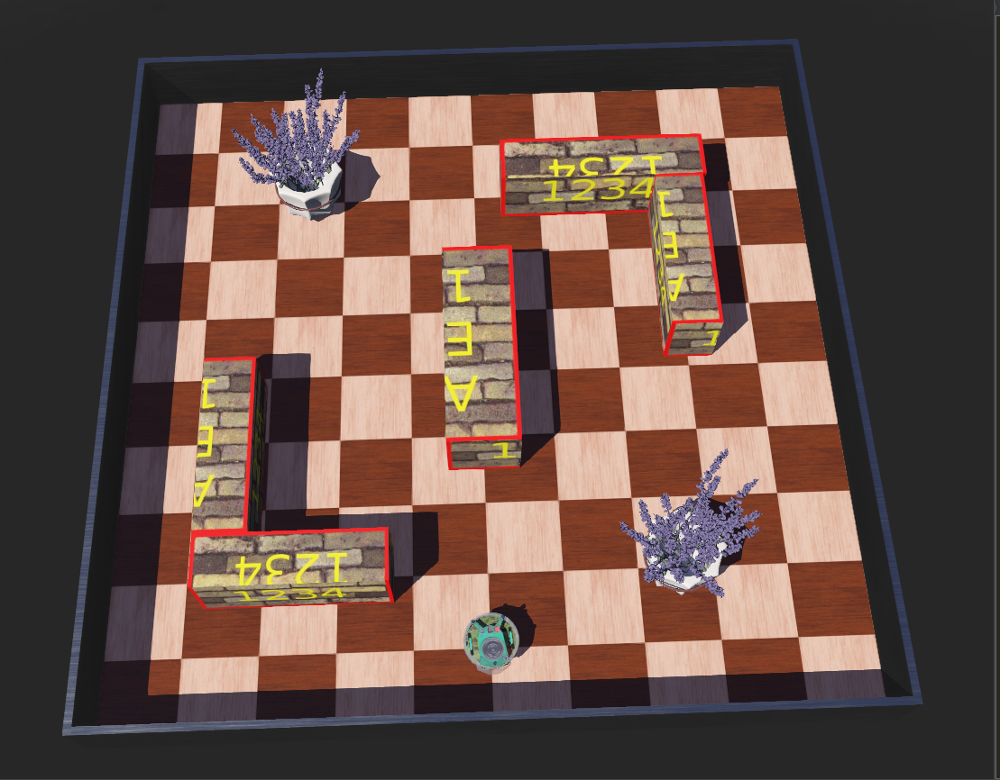
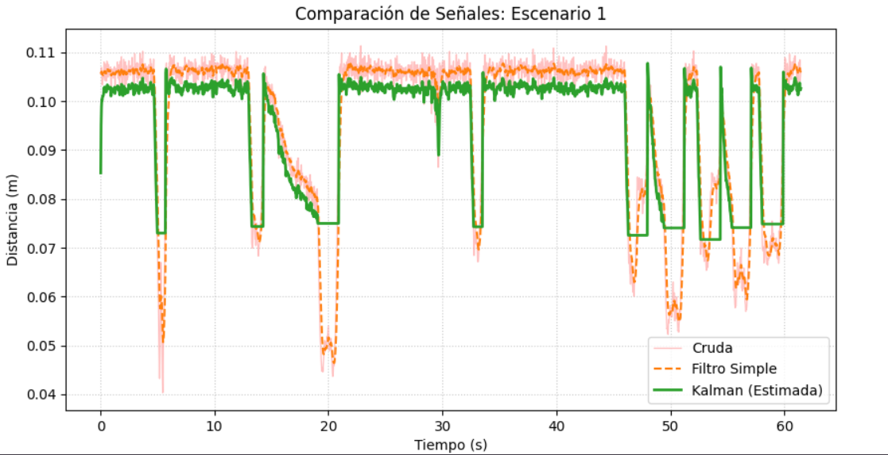
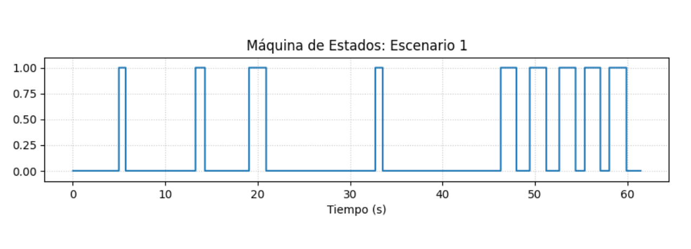
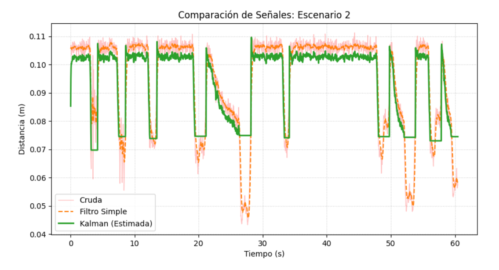
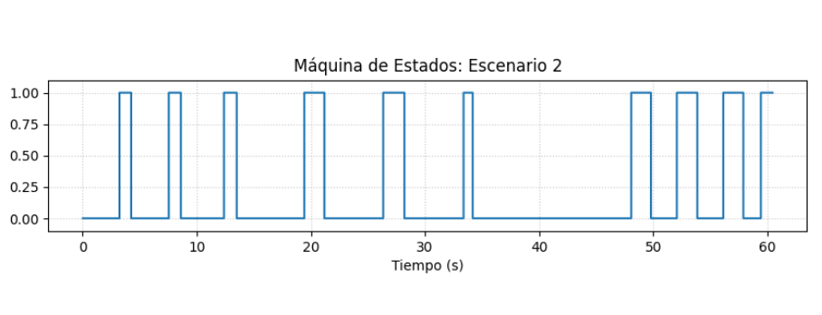
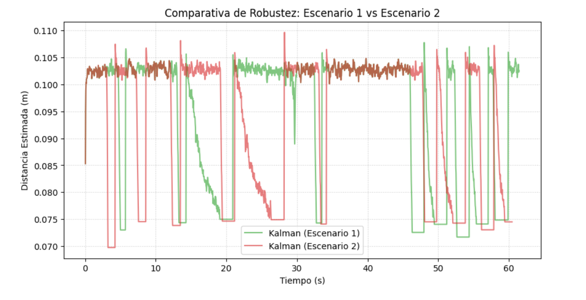

# Laboratorio 2: Navegación reactiva con filtrado y fusión de sensores en Webots

## Integrantes
* Bárbara Oyarzo Alfaro 
* Lucas Contreras Delgado
* Constanza Suarez Huerta
* Eduardo Cordero Cortes
* Francisco Díaz Miranda
---

## 1. Objetivo del Trabajo
Implementar un sistema de navegación reactiva en Webots para un robot móvil diferencial, utilizando sensores de distancia y encoders de rueda, aplicando filtrado sobre las mediciones y empleando un filtro de Kalman para estimar la distancia frontal a obstáculos y mejorar la toma de decisiones.

---

## 2. Descripción del Robot y Sensores Utilizados
Se utiliza el robot móvil diferencial **e-puck** dentro del entorno de simulación Webots. La configuración empleada en los controladores comprende:

* **Actuadores:** Motores de rueda (`left wheel motor`, `right wheel motor`) configurados para control de velocidad.
* **Sensores de Proximidad (IR):** Ocho sensores (`ps0` a `ps7`). Según el controlador:
    * **Sensores para distancia frontal:** `ps0`, `ps1`, `ps6`, `ps7` (se calcula el valor máximo entre ellos para obtener `z`).
    * **Sensores para decisión de giro:** `ps5` (lateral izquierdo) y `ps2` (lateral derecho).
* **Encoders de Rueda:** `left wheel sensor` y `right wheel sensor` para medir la posición angular.

---

## 3. Frecuencia de Muestreo
La frecuencia de muestreo es el parámetro crítico que garantiza la estabilidad del filtro de Kalman y la precisión de la odometría. Se determina a partir del `basicTimeStep` configurado en el archivo `.wbt` del entorno. La resolución temporal está definida por el paso de tiempo (`timestep`) del simulador; la conversión a unidades del Sistema Internacional (segundos) y la determinación de la frecuencia de operación son:

* **Paso de tiempo:** $\Delta t = 32 \text{ ms} = 0.032 \text{ s}$
* **Periodo de muestreo ($T_s$):** Es el intervalo entre iteraciones del bucle de control:
    $$T_s = \frac{\Delta t}{1000} = 0.032 \text{ s}$$
* **Frecuencia de muestreo ($f_s$):** Define cuántas actualizaciones se ejecutan por segundo:
    $$f_s = \frac{1}{T_s} = \frac{1}{0.032} = 31.25 \text{ Hz}$$


Esto significa que el controlador ejecuta toda la lógica (lectura de sensores, filtro de Kalman y decisión de giro) exactamente **31.25 veces por segundo**. Es decir, el robot actualiza sus acciones cada 32 milisegundos. Esta constante temporal es crítica porque los cálculos matemáticos dentro del filtro de Kalman dependen de este intervalo para predecir la posición y corregir las mediciones, asegurando un movimiento fluido sin errores de cálculo acumulativos.

El volumen de datos obtenido en las simulaciones (1921 y 1890 iteraciones, respectivamente) valida el comportamiento y la robustez del sistema de navegación reactiva a lo largo de aproximadamente 60 segundos de experimentación continua en cada entorno de prueba, garantizando una base de datos consistente para el análisis de señales.

---

## 4. Análisis de las Señales Registradas

El análisis se basó en el procesamiento de las señales `raw_ps0` (lectura cruda) frente a la estimación `kalman_est` obtenida mediante el filtro de Kalman en ambos escenarios de prueba.

### Caracterización del Ruido

Se determinó que la señal `raw_ps0` presenta una volatilidad de alta frecuencia, con picos que inducen falsos positivos en la máquina de estados. Esta inestabilidad es la causa principal del *chattering* (conmutación errática) en la lógica de control. El filtrado de Kalman permitió transformar esta señal ruidosa en una curva de estimación coherente, permitiendo que la variable `decision` fuera estable durante la navegación.

### Dinámica del Escenario 1 vs. 2

Como se observa en la comparación de estimaciones (ver Figura 1), el Escenario 2 presenta una mayor frecuencia de eventos de detección. Mientras que el Escenario 1 permite trayectorias lineales más prolongadas, el Escenario 2 obliga al filtro a responder ante obstáculos recurrentes.

### Ganancia y Estabilidad

La evolución de la ganancia `K_real` confirma que el sistema ajusta su confianza dinámicamente; en los tramos de mayor complejidad (Escenario 2), el filtro prioriza la robustez para evitar colisiones, validando la eficacia de la fusión sensorial entre los encoders (`l_encoder`, `r_encoder`) y la respuesta infrarroja.




**Figura 1:** Comparación de la estimación de Kalman entre el Escenario 1 (azul) y el Escenario 2 (naranja). Se observa una mayor frecuencia de respuestas evasivas y ajustes en el Escenario 2 debido a la complejidad del entorno.

---

## 5. Estimación del Avance mediante Encoders

La estimación de la posición del robot se fundamenta en la odometría de las ruedas, utilizando los datos proporcionados por los sensores de posición angular (encoders). El desplazamiento lineal incremental ($\Delta s$) del robot se calcula a partir de la variación de la posición angular de las ruedas izquierda ($\theta_l$) y derecha ($\theta_r$).

### 5.1 Modelo cinemático incremental
Dado el radio de la rueda ($r = 0.0205 \text{ m}$), el desplazamiento lineal del robot se obtiene mediante la relación fundamental:

$$s = r \cdot \theta$$

Donde $\theta$ representa el desplazamiento angular medio de las ruedas. Por lo tanto, el incremento de desplazamiento entre dos instantes de tiempo consecutivos ($k-1$ y $k$) se calcula como:

$$\Delta s_k = r \cdot \frac{(\theta_{l, k} - \theta_{l, k-1}) + (\theta_{r, k} - \theta_{r, k-1})}{2.0}$$

Donde:

* $\theta_{l, k}, \theta_{r, k}$: Lecturas actuales de los encoders.
* $\theta_{l, k-1}, \theta_{r, k-1}$: Lecturas en el instante de tiempo anterior.

Este valor $\Delta s_k$ es la variable de control esencial para la **etapa de predicción** del filtro de Kalman, permitiendo estimar el avance del robot y proyectar la distancia frontal futura antes de integrar la nueva medición ruidosa de los sensores infrarrojos.

---

## 6. Filtro simple aplicado
Para pre-procesar las mediciones de los sensores, se implementó un filtro de suavizado exponencial aplicado en el bucle principal del controlador. Esta etapa reduce el ruido de alta frecuencia, permitiendo que la navegación base sus decisiones en una tendencia estable y no en lecturas instantáneas ruidosas.

El código implementa la siguiente relación:
$$d_{filtrada, k} = \alpha \cdot z_k + (1 - \alpha) \cdot d_{filtrada, k-1}$$
Donde $z_k$ es la distancia calculada desde el sensor y $\alpha = 0.2$ es el factor de suavizado que equilibra la respuesta frente a cambios bruscos.

---

## 7. Implementación del filtro de Kalman
El filtro de Kalman fusiona la información cinemática de los encoders (predicción) con las mediciones ruidosas de los sensores (corrección) para obtener una estimación óptima.

### 7.1 Etapas de predicción y corrección
El algoritmo opera cíclicamente en cada iteración:
* **Etapa de predicción:** Se estima la distancia futura basándose en el modelo de movimiento del robot:
    $$\hat{d}_{k}^{-} = \hat{d}_{k-1} + \Delta s_k$$
    Aquí, la predicción es la creencia del robot basada en su odometría.
* **Etapa de corrección:** Se ajusta la predicción utilizando la medición $z_k$ capturada por los sensores:
    $$\hat{d}_{k} = \hat{d}_{k}^{-} + K_{k}(z_{k} - \hat{d}_{k}^{-})$$
    Esta etapa minimiza el error mediante la ganancia de Kalman.

### 7.2 Ganancia de Kalman ($K_k$)
La ganancia $K_k$ es el factor de ponderación dinámico que decide qué fuente de información es más fiable en cada instante. Se calcula como:
$$K_{k} = \frac{P_{k}^{-}}{P_{k}^{-} + R}$$
Donde:
* **$P_{k}^{-}$ (Covarianza de la predicción):** Representa la incertidumbre de nuestro modelo de movimiento.
* **$R$ (Varianza de medición):** Representa el ruido inherente del sensor.


Interpretación en la navegación:
* Si la medición del sensor es muy ruidosa ($R$ grande), la ganancia disminuye ($K_k \to 0$), por lo que el robot **confía más en su propia odometría**.
* Si la predicción es muy incierta ($P_k^-$ grande), la ganancia aumenta ($K_k \to 1$), obligando al filtro a **ajustarse más a la medición real** del entorno.

---

## 8. Lógica de Navegación Reactiva Implementada

El sistema de navegación se implementó mediante una **Máquina de Estados Finitos (FSM)**, la cual permite una transición determinista entre el comportamiento de exploración y el de evasión, garantizando la seguridad del robot ante obstáculos imprevistos.

### 8.1 Definición de los estados
El controlador opera bajo dos estados principales, gobernados por la variable de estado `turning` y la distancia estimada ($\hat{d}_k$):

* **Estado de Avance (Forward):** Es el modo operativo por defecto. El controlador aplica una velocidad angular constante a ambos motores, manteniendo una trayectoria rectilínea. En este estado, el sistema monitorea continuamente $\hat{d}_k$ mediante el filtro de Kalman.
* **Estado de Evasión (Turn):** Se activa cuando $\hat{d}_k \leq \text{ENTER\_DISTANCE}$ (0.075 m). El robot detiene su avance lineal para priorizar la maniobra de giro. Este estado se mantiene hasta que la rotación acumulada de las ruedas alcanza el `target_wheel_rotation` o se supera un `safety_timer` de seguridad, garantizando que el robot no quede bloqueado ante obstáculos complejos.

### 8.2 Lógica de decisión y dirección
La elección de la dirección de giro depende de la percepción espacial del entorno mediante los sensores laterales (`ps2` y `ps5`):

1. **Evaluación de proximidad:** Al detectar el obstáculo, el sistema ejecuta una comparación lógica: `if ps5 > ps2`.
2. **Determinación de giro:**
    * Si la lectura lateral derecha (`ps5`) indica mayor proximidad, el sistema dispara la bandera `turn_right`.
    * En caso contrario, se selecciona `turn_left`.
3. **Ejecución:** Una vez seleccionada la dirección, se aplican velocidades diferenciales (`v = 2.5` y `-2.5`) a los motores, permitiendo que el robot gire sobre su propio eje.


### 8.3 Criterios de transición (Histéresis)
La robustez de esta lógica radica en sus umbrales de histéresis. La transición de regreso al estado *Forward* no ocurre inmediatamente, sino cuando la distancia supera el umbral de salida (`EXIT_DISTANCE = 0.105 m`). Esto evita el "chatter" o rebote de estados, donde el robot podría oscilar rápidamente entre avanzar y girar si la señal fuera ruidosa.

---

# 9. Gráficos de Señales Crudas, Filtradas y Estimadas

Para evaluar el desempeño del sistema de fusión sensorial, se diseñaron dos entornos de prueba en Webots. A continuación, se presentan los resultados obtenidos tras procesar las secuencias de datos registradas durante la simulación.

## 9.1 Escenarios de Prueba

### Escenario 1: Entorno Simple

Configuración con obstáculos aislados, utilizada para verificar el funcionamiento del filtro de Kalman en condiciones de baja incertidumbre y con trayectorias relativamente despejadas.


### Escenario 2: Entorno Complejo

Configuración compuesta por pasillos estrechos y múltiples obstáculos, diseñada para evaluar la robustez del sistema de navegación ante condiciones más exigentes y mayores variaciones en las mediciones de los sensores.




## 9.2 Gráficos de comparación




**Figura 1. Comparación de señales - Escenario 1.**  
*Utilidad:* Permite evaluar la reducción del ruido en la medición frontal mediante la comparación directa entre la señal cruda, la señal filtrada y la estimación obtenida mediante el filtro de Kalman.

---

### Comparación de Señales - Escenario 2



**Figura 2. Comparación de señales - Escenario 2.**  
*Utilidad:* Demuestra la eficacia del filtro para mantener una estimación estable frente a la alta frecuencia de obstáculos presentes en el entorno.

---

### Máquina de Estados - Escenario 1



**Figura 3. Máquina de Estados - Escenario 1.**  
*Utilidad:* Visualiza la toma de decisiones del robot (0: Avance, 1: Giro), permitiendo verificar la consistencia entre la detección de obstáculos y la respuesta de navegación.

---

### Máquina de Estados - Escenario 2



**Figura 4. Máquina de Estados - Escenario 2.**  
*Utilidad:* Permite analizar la frecuencia de maniobras evasivas realizadas por el robot en un entorno con múltiples obstáculos y zonas de paso reducidas.

---

### Ganancia de Kalman (K)



**Figura 5. Evolución de la Ganancia de Kalman (K).**  
*Utilidad:* Representa la convergencia del filtro y la ponderación dinámica de confianza entre la predicción basada en odometría y las mediciones provenientes de los sensores de proximidad.

---

# 10. Resultados Obtenidos en los Escenarios de Prueba

La evaluación del sistema se fundamenta en la integración de datos provenientes de los sensores infrarrojos de proximidad con un modelo predictivo basado en odometría, combinados mediante un filtro de Kalman. La eficacia de esta arquitectura se analiza mediante la relación entre la distancia frontal estimada, las lecturas de los sensores y las transiciones de la máquina de estados utilizada para la navegación reactiva.

## 10.1 Escenario 1: Entorno Simple


Al contrastar la **Figura 1** (Comparación de señales) con la **Figura 2** (Máquina de estados), se observa que la estimación obtenida mediante el filtro de Kalman reduce significativamente el ruido de alta frecuencia presente en la señal cruda. Esta reducción de las fluctuaciones permite obtener una representación más estable de la distancia frontal al obstáculo.

En la **Figura 2** se aprecia una correspondencia clara entre la distancia estimada y las decisiones de navegación: el estado de giro se activa únicamente cuando la distancia frontal desciende por debajo del umbral de seguridad definido para la evasión de obstáculos. A diferencia de una estrategia basada exclusivamente en sensores crudos, donde pequeñas variaciones podrían generar activaciones erróneas o cambios constantes de estado, la estimación filtrada proporciona una respuesta más consistente y estable.

Como resultado, el robot mantiene trayectorias más suaves, reduce la cantidad de maniobras innecesarias y mejora la continuidad del movimiento en zonas despejadas.


## 10.2 Escenario 2: Entorno Complejo

A partir de la comparación entre la **Figura 3** (Comparación de señales) y la **Figura 4** (Máquina de estados), se observa que el filtro de Kalman mantiene una estimación estable incluso en presencia de variaciones abruptas y ruido en las lecturas de los sensores de proximidad.

La **Figura 5**, correspondiente a la evolución de la ganancia de Kalman (*K*), permite apreciar cómo el filtro ajusta dinámicamente la confianza depositada en la predicción basada en odometría y en las mediciones de los sensores. Este mecanismo de adaptación contribuye a mantener una estimación coherente de la distancia frontal durante las maniobras de evasión.

La combinación de la distancia estimada mediante Kalman con la información proporcionada por los sensores laterales permitió seleccionar adecuadamente la dirección de giro y mantener una navegación estable dentro de los pasillos. Gracias a esta estrategia, el robot logró evitar colisiones y reducir comportamientos erráticos que podrían surgir al utilizar únicamente las mediciones crudas de los sensores.

En consecuencia, el sistema demostró una mayor robustez frente a entornos complejos, manteniendo un comportamiento consistente incluso bajo condiciones de elevada incertidumbre y alta frecuencia de detección de obstáculos.

---

# 11. Análisis Final y Conclusiones

Tras el desarrollo del laboratorio y la implementación del sistema de navegación reactiva, se establecen las siguientes conclusiones técnicas:

**Robustez mediante Fusión Sensorial**: Se demostró que la fusión de información, mediante el filtro de Kalman, es indispensable para la navegación en entornos dinámicos. Mientras que los sensores infrarrojos presentan un ruido de alta frecuencia que induciría a giros erráticos (*chattering*), la odometría pura (encoders) deriva por el deslizamiento de las ruedas. El filtro logró combinar la precisión a corto alcance de los sensores con la suavidad del modelo predictivo, resultando en una estimación de distancia significativamente más fiable que cualquier sensor tomado de forma individual.

**Eficacia de la Lógica de Control (Máquina de Estados)**: La implementación de una máquina de estados finitos, alimentada por la señal filtrada, permitió una navegación reactiva fluida. El uso de umbrales de seguridad basados en la estimación de Kalman eliminó el *chattering* que se habría observado con señales crudas, garantizando que el robot solo transicione al estado de giro (1) cuando la amenaza de colisión es estadísticamente significativa. La ganancia de Kalman ($K_k$) observada (Figura 5) valida que el filtro alcanzó un estado de convergencia óptimo, priorizando la corrección sensorial cuando el entorno presenta alta incertidumbre.

**Adaptabilidad ante la Complejidad**: La comparativa entre el Escenario 1 y el Escenario 2 confirmó la escalabilidad del sistema. El análisis de las señales estimadas (presentado en la Sección 4) permite visualizar cómo, ante entornos complejos, el filtro de Kalman aumenta su exigencia, manteniendo una trayectoria consistente y minimizando el error frente a la mayor frecuencia de obstáculos. En entornos complejos (pasillos estrechos y esquinas), el robot mantuvo una trayectoria consistente gracias a la integración de la estimación frontal y los sensores laterales. Esto valida el objetivo del laboratorio: no solo se logró la evasión de obstáculos, sino que se implementó una arquitectura de navegación capaz de gestionar la incertidumbre y el ruido, demostrando que el diseño propuesto es apto para tareas de robótica autónoma en entornos con alta carga dinámica.

---

## 12. Instrucciones para Ejecutar la Simulación 

### Requisitos
- Webots R2025a o superior
- Python 3.x

---

### Configuración de la Ruta de Guardado

Antes de ejecutar la simulación, se debe modificar la variable `save_dir` ubicada en:

```txt
controllers/my_controller_lab2/my_controller_lab2.py
```

La ruta debe corresponder al computador utilizado. Por ejemplo:

```python
save_dir = r"C:\Users\TU_USUARIO\Downloads\dat"
```

También puede utilizarse una ruta adaptable automáticamente al usuario:

```python
save_dir = os.path.join(os.path.expanduser("~"), "Downloads", "dat")
```

---

### Ejecución

1. Abrir Webots.
2. Seleccionar:
   ```txt
   File > Open World
   ```
3. Abrir alguno de los escenarios:
   ```txt
   worlds/escenario1.wbt
   ```
   o
   ```txt
   worlds/escenario2.wbt
   ```
4. Verificar que el robot tenga asignado el controlador:
   ```txt
   my_controller_lab2
   ```
5. Ejecutar la simulación utilizando el botón **Play**.

---

### Resultados

Durante la simulación se genera automáticamente el archivo:

```txt
resultados_laboratorio.csv
```

Este archivo almacena:
- señales crudas,
- señales filtradas,
- estimaciones mediante Kalman,
- lecturas de encoders,
- estados y decisiones de navegación.

---

### Escenarios de Prueba

- **Escenario 1:** entorno simple con pocos obstáculos.
- **Escenario 2:** entorno complejo con múltiples obstáculos y pasillos estrechos.